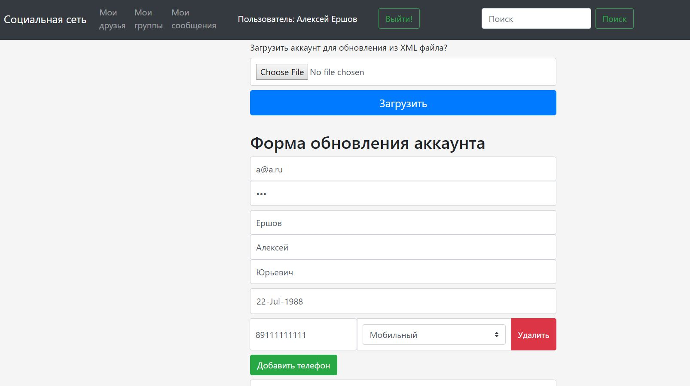

# Project "Social Network"  

**Functionality:**  

+ registration  
+ display profile  
+ edit profile  
+ upload profile picture  
+ authentication with Spring Security  
+ AJAX search autocomplete  
+ AJAX search with pagination  
+ users export to XML / import from XML  
+ messaging through WebSocket  
+ posting on wall  
+ groups creation  
+ adding/removing friends  

**Tools:**  
JDK 7, 8, Spring 5, JPA 2 / Hibernate 5, XStream, jQuery 3, Twitter Bootstrap 4, JUnit 4, Mockito, Maven 3, Git / Bitbucket, Tomcat 7, MySQL, IntelliJIDEA 2018.  

**Notes:**  
MySQL ddl is located in the `db/ddl.sql`  

**Screenshots**  
  
  
  
  
  
The project hosted at [https://socnetershov.herokuapp.com](https://socnetershov.herokuapp.com)  
  
Test account: petrov@gmail.com  
Password: qwerty  
_  
**Ershov Alexey**  
Training getJavaJob  
[http://www.getjavajob.com](http://www.getjavajob.com)